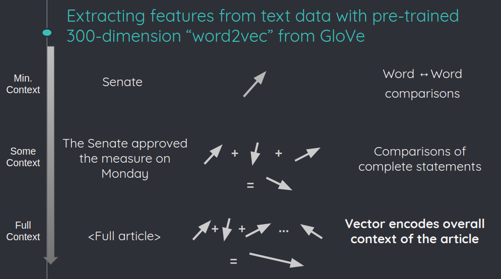

# The Newsiness Initiative
## Highlighting the analysis and opinion contained in news articles
### [http://newsiness.world](http://newsiness.world)

The purpose of this project is to classify the content of news articles, distinguishing between statements of what happened (when, where, and to whom) from those that contain analysis and opinion.

## The Training Corpus

A Support Vector Machine (SVM) classifying algorithm is trained on labeled articles scrapped from various websites.  Approximately 90 articles, each, were collected from Reuters and The Associated Press, to form the 'newsy' training dataset.  Approximately 180 opinion pieces from The New York Times were used to form the 'not-newsy' training dataset.  The article URLs, and content, from these, and other, sources are stored in an SQL database.

The executable python script `./update_db.py` can be used to scrape the top articles from each news source and add them to the SQL database for later use.  This step is not neccesary to use the pre-trained classifier, stored in `inputs/classifier.pickle`, but is neccesary in order to redo the training.

## Pre-trained 'word2vec'

Each article, whether it is one used to train the SVM classifier, or it is an input to be analyzed, is mapped to a single 300-dimension vector.  This is done, by first mapping each word in the article (excluding stop words, e.g. "a", "and", "but", "how", "or", and "what") to the 300-dimensional vector space.  The mapping is acomplished with the pretrained model from [GloVe](https://nlp.stanford.edu/projects/glove/).  The vector space is constructed such that it captures both the meaning and context of the word.  For example, words such as "cat" and "dog" will point in similar directions, as will "cat" and "feline".  The weighted average of all word vectors from an article is then used to encode the complete context of that article.  The weights for each vector are determined using term frequency–inverse document frequency (tf-idf), which quantifies how important a word is in the document, relative to the entire corpus.  The word2vector mapping as descripted schematically in the image below.

