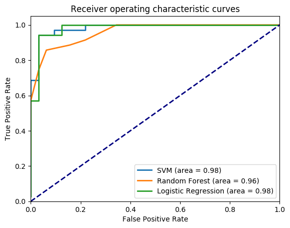
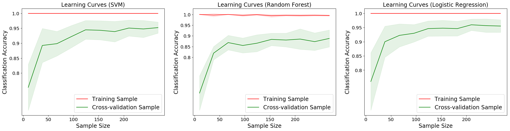

# The Newsiness Initiative
## Highlighting the analysis and opinion contained in news articles
### [http://newsiness.world](http://newsiness.world)

The purpose of this project is to classify the content of news articles, distinguishing between statements of what happened (when, where, and to whom) from those that contain analysis and opinion.

## The Training Corpus

A Support Vector Machine (SVM) classifying algorithm is trained on labeled articles scrapped from various websites.  Approximately 90 articles, each, were collected from Reuters and The Associated Press, to form the 'newsy' training dataset.  Approximately 180 opinion pieces from The New York Times were used to form the 'not-newsy' training dataset.  The article URLs, and content, from these, and other, sources are stored in an SQL database.

The executable python script `./update_db.py` can be used to scrape the top articles from each news source and add them to the SQL database for later use.  This step is not neccesary to use the pre-trained classifier, stored in `inputs/classifier.pickle`, but is neccesary in order to redo the training with a different corpus, or a different 'word2vec' model.  To create the SQL database, amke sure you have the neccesary packages installed and the postgresql service running in your environment.  Then execute from the command line: `createdb NewsinessDB -U <username>`.  Then edit the database with `psql -d NewsinessDB` and create the table with
`CREATE TABLE articles (
 articleID SERIAL PRIMARY KEY,
 source_name varchar(20),
 url varchar(300),
 time_found integer NOT NULL,
 source_type news_type);`

## Pre-trained 'word2vec'

Each article, whether it is one used to train the SVM classifier, or it is an input to be analyzed, is mapped to a single 300-dimension vector.  This is done, by first mapping each word in the article (excluding stop words, e.g. "a", "and", "but", "how", "or", and "what") to the 300-dimensional vector space.  The mapping is acomplished with the pretrained model from [GloVe](https://nlp.stanford.edu/projects/glove/).  The vector space is constructed such that it captures both the meaning and context of the word.  For example, words such as "cat" and "dog" will point in similar directions, as will "cat" and "feline".  The weighted average of all word vectors from an article is then used to encode the complete context of that article.  The weights for each vector are determined using term frequency–inverse document frequency (tf-idf), which quantifies how important a word is in the document, relative to the entire corpus.  To improve the performance of the web application, the entire word2vector mapping is stored in an SQL table.

The word2vector mapping is described schematically in the image below.

### Additional considerations

[GloVe](https://nlp.stanford.edu/projects/glove/) provides pre-trained word2vector models in 50, 100, 200, and 300-dimensions.  All four models were compared, and all four were able to succesfully classify the training corpus.  However, when the SVM classifier was pushed beyond its training, and used to classify individual sentences (see the discussion on interpreting the results below), the 300-dimaension representation significantly outperformed the lower dimensional models.

Two other techniques for feature extraction were considered.  Namely, n-grams and Google's pre-trained word2vector model.  A 2010 (report)[http://aclweb.org/anthology/W03-1017] by H. Yu and V. Hatzivassiloglou used n-grams and sentiment analysis to achieve a recall of 97\% on articles, but 91\% on sentences.  This report used articles from the Wall Street Journal to train the classifier.  In 2012, K. Busch posted a (report)[https://nlp.stanford.edu/courses/cs224n/2012/reports/kat_busch_writeup.pdf] using unigrams, achieving an F1 score of 91\%.  The primary take away from thsi work was a list of important words.  Although, the performance is comparable to that found in this project, the conclusions were quite different.

The model from Google could be used in the future as a valuable cross check of the results presented here.

## Training and Validating the Model

The SVM classifier was trained on the 300-dementional vectors derived from each labeled article in the training corpus (described above).  The SVM model begin used in the web application has been pre-trained and can be found in `inputs/classifier.pickle`.

This section describes how to re-train and validate the model.

If you chose to create and fill your own article SQL database, you can simply run `./train_model.py`, otherwise execute `./train_model.py --redo=False` to use the default corpus.  You can add additional classification algorithms with the options: `--doRF=True` (for a Random Forest model) and/or `--doLR=True` (for a Logistic Regression model).  If you are using the default option `--redo=True`, you have the addional choice of which pre-trained [GloVe](https://nlp.stanford.edu/projects/glove/) model you would like to use.  Use the option `--nDim=x`, with x equal to 50, 100, 200 or 300 (the default).  For a full list of options, use `./train_model.py`.

